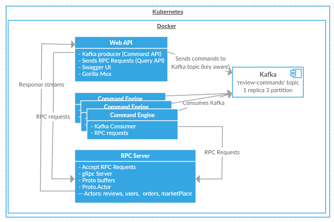

[](https://travis-ci.org/farukterzioglu/micGo-services) [](https://codeclimate.com/github/farukterzioglu/micGo-services/maintainability) [](https://codeclimate.com/github/farukterzioglu/micGo-services/test_coverage) [](https://github.com/farukterzioglu/micGo-services) [](https://discord.gg/fNcD2Cd) []() [](http://hits.dwyl.io/farukterzioglu/micGo-services)



For Kubernetes setup, see [README-K8S](README-K8S.md)

Type 'make' to see all commands. [(makefile)](makefile)

### Start Kafka & Zookeper w/ docker-compose

Start Zookeper & Kafka, create topics "create-review"  
`docker-compose up`

### Start Kafka & Zookeper

https://github.com/ches/docker-kafka

```
Set-Variable -Name "ipAddress" -Value "172.24.96.1"
docker run -d --name zookeeper -p 2181:2181 jplock/zookeeper
docker run -d --name kafka -p 7203:7203 -p 9092:9092 -e KAFKA_ADVERTISED_HOST_NAME=$ipAddress -e KAFKA_MESSAGE_MAX_BYTES=3000000 -e KAFKA_REPLICA_FETCH_MAX_BYTES=3100000 -e ZOOKEEPER_IP=$ipAddress ches/kafka
docker run --rm ches/kafka kafka-topics.sh --create --topic create-review --replication-factor 1 --partitions 1 --zookeeper ($ipAddress + ':2181')
docker run --rm ches/kafka kafka-topics.sh --list --zookeeper ($ipAddress + ':2181')
docker run --rm --interactive ches/kafka kafka-console-producer.sh --topic tags --broker-list ($ipAddress + ':9092')
```

From another powershell instance

```
Set-Variable -Name "ipAddress" -Value "192.168.1.5"
docker run --rm ches/kafka kafka-console-consumer.sh --topic create-review --from-beginning --zookeeper ($ipAddress + ':2181')
docker run --rm --interactive ches/kafka kafka-consumer-groups.sh --new-consumer --describe --group group1 --bootstrap-server (\$ipAddress + ':9092')
```

### Check kafka instance details

```
docker exec -it zookeeper bash
bin/zkCli.sh -server 127.0.0.1:2181
ls /brokers
ls /brokers/topics
ls /consumers
```

### Command Engine

Reads from kafka topic and handles commands (new comment etc.) in go routines

```
go run . -server_addr="localhost:3000" -kafka_brokers="localhost:9092" -group_id="test"

$ docker build -f ./build/Review.CommandEngine/Dockerfile -t command-engine:latest .
$ docker run -it command-engine:latest -server_addr="localhost:3000" -kafka_brokers="[docker host ip address]]:9092" -group_id="test"
```

### Command Rpc Server

Handles rpc commands

```
go run .

$ docker build -f ./build/Review.CommandRpcServer/Dockerfile -t command-rpcserver:latest .
$ docker run -it -p 3000:3000 command-rpcserver:latest
```

### Review api

```
cd .\Review.API
go run . -kafka_brokers='127.0.0.1:9092' -server_addr="localhost:3000"

$ docker build -f ./build/Review.API/Dockerfile -t review-api:latest .
$ docker run -it -p 8000:8000 review-api:latest -kafka_brokers="172.19.0.2:9092" -server_addr="localhost:3000" -port="8000"

// Navigate to http://localhost:8000/swaggerui/
```
